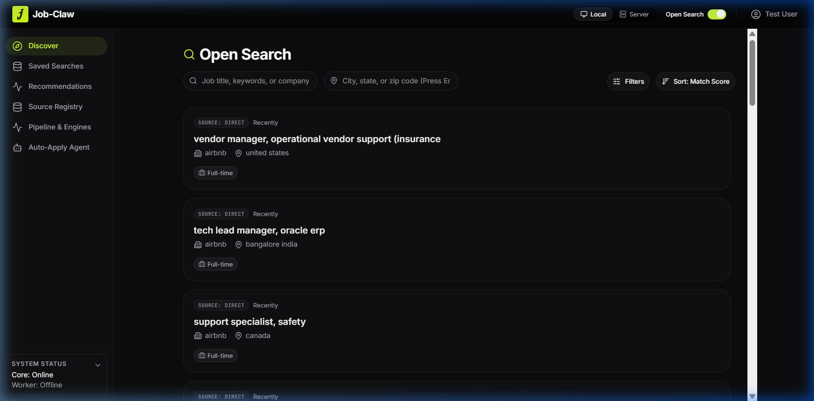
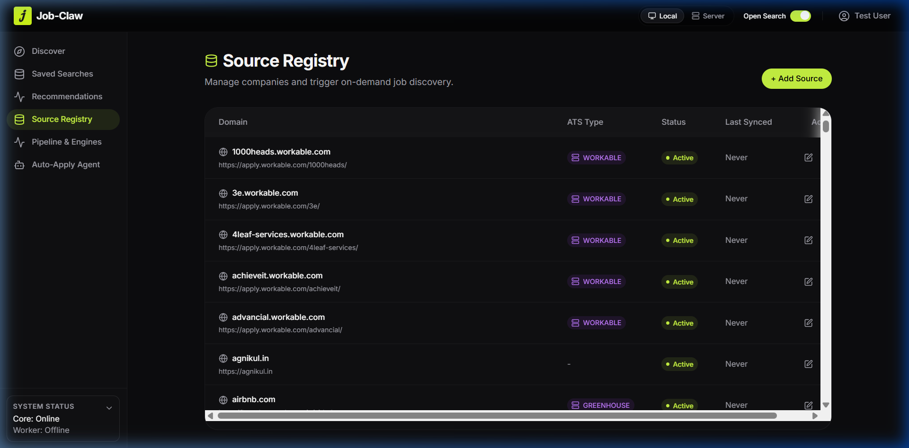
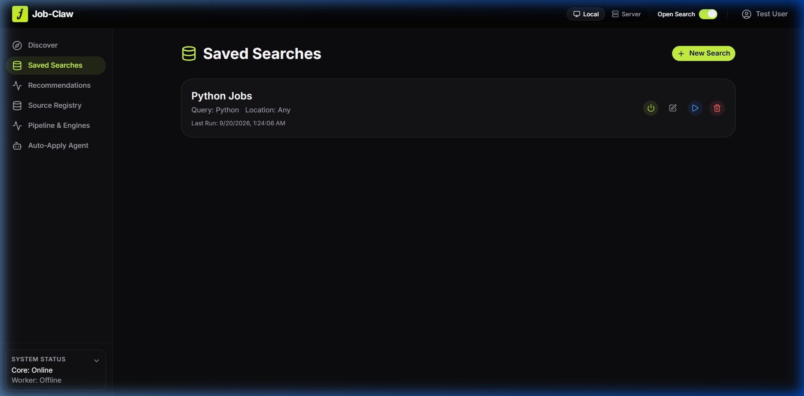
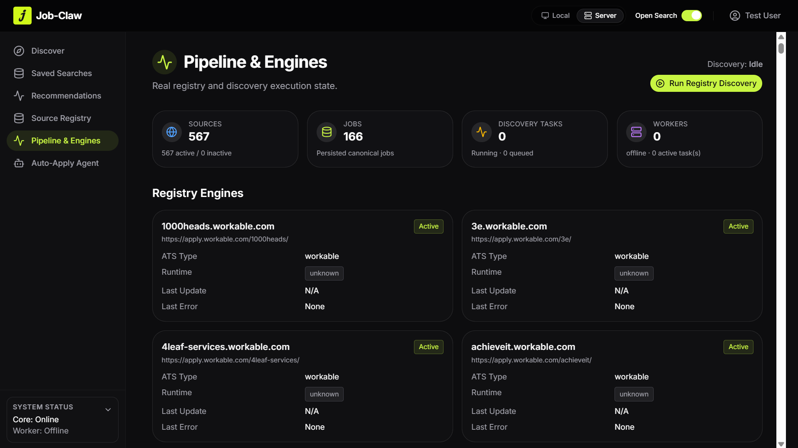

<div align="center">
  
  
  # Job-Claw
  
  **An intelligent, full-stack job discovery, matching, and application orchestrator.**
  
  [](https://nextjs.org/)
  [](https://fastapi.tiangolo.com/)
  [](https://www.postgresql.org/)
  [](https://redis.io/)
  [](https://www.typescriptlang.org/)
</div>

<br />

Job-Claw automates the grueling job search process. It intelligently discovers the best job opportunities across ATS platforms and company career pages, scores them directly against your unique profile using LLMs (Groq & Gemini), and orchestrates applications seamlessly on your behalf.

## ✨ Previews

<div align="center">
  
  
</div>
<div align="center" style="margin-top: 10px;">
  
  
</div>

<br />

## 🚀 Key Features

- **Automated ATS Discovery**: Continuously crawls Greenhouse, Lever, Workday, and custom ATS systems to find newly posted jobs.
- **Intelligent LLM Matching**: Utilizes a dual-sequence AI layer (Groq + Gemini fallback) to semantically score candidate profiles against job requirements and generate detailed match reasoning.
- **Source Registry Management**: Curate, monitor, and seed hundreds of target domains and career pages from a unified dashboard.
- **Real-Time Dashboard**: A premium, highly responsive Next.js App Router frontend featuring live status updates via Server-Sent Events (SSE).

### 🚧 In Development (Coming Soon)
- **Auto-Apply Agent (Playwright Orchestration)**: An autonomous agent designed to navigate ATS portals and submit job applications on your behalf using your synced Candidate Profile. *(UI layout is present, but backend playwright automation is currently being built).*

---

## 🏗️ Architecture & Technology Stack

Job-Claw is a highly-scalable monorepo divided into a Python-based asynchronous control plane and a React-based frontend dashboard.

### 🎨 Frontend (`/frontend`)
A modern, dark-mode-first dashboard engineered for a flawless user experience.
- **Framework**: Next.js 16 (App Router), React 19
- **Language**: TypeScript
- **Styling**: Tailwind CSS v4, custom global design system, and Shadcn UI (Base UI)
- **Icons & Animation**: Lucide Icons, tw-animate-css

### ⚙️ Backend (`/backend`)
A high-performance asynchronous control plane and scraping engine.
- **Framework**: FastAPI (Python 3.10+)
- **Database**: PostgreSQL with `asyncpg` and SQLAlchemy ORM
- **Task Queue**: Distributed background workers orchestrated via ARQ and Redis
- **AI Integration**: Groq and Google Gemini API for intelligent parsing and scoring

---

## 🛠️ Quick Start (Local Development)

To spin up the entire application locally, ensure you have **Node.js**, **Python 3.10+**, **PostgreSQL**, and **Redis** installed.

### 1. Database & Redis Setup
Ensure your local PostgreSQL is running on port `5432` and Redis is running on port `6379`.

### 2. Backend Setup
Navigate to the backend directory, configure the environment, and spin up the API and background workers.

```bash
cd backend
python -m venv .venv

# Activate the virtual environment
# Windows: .venv\Scripts\activate
# Mac/Linux: source .venv/bin/activate
pip install -r requirements.txt

# Configure your environment
cp .env.example .env
# Open .env and add your Postgres credentials, Groq API key, and Gemini API key

# Setup the database
python create_db.py

# Seed the database with ATS sources (Workable, WordPress, etc.)
python scripts/seed_registry.py

# Start the FastAPI server (Port 8000)
uvicorn app.main:app --reload --port 8000
```

*In a separate terminal, start the background ARQ worker:*
```bash
cd backend
# Ensure virtual environment is activated
python -m arq app.workers.settings.WorkerSettings
```

### 3. Frontend Setup
Navigate to the frontend directory, install dependencies, and start the development server.

```bash
cd frontend
npm install

# Start the Next.js development server
npm run dev
```

The UI will now be available and fully functional at **[http://localhost:3000](http://localhost:3000)**.

---

## 🧪 Testing

Job-Claw is rigorously tested across both stacks:
- **Backend**: Uses `pytest` and `pytest-asyncio` for unit and integration testing against a test database. Run with `pytest` in the `/backend` directory.
- **Frontend**: Utilizes `Playwright` for comprehensive end-to-end user flow testing. Run with `npx playwright test` in the `/frontend` directory.

